<!-- _class: lead -->

# Getting Started
## VS Code + UV Setup

**Live Demo: From Zero to First Project**

---

## What We'll Cover

**Step-by-step setup:**

1. 📥 Install VS Code
2. 🧩 Add Python extensions
3. ⚡ Install UV (package manager)
4. 🚀 Create your first project

**Goal:** By the end, you'll have a working Python development environment!

---

<!-- _class: lead -->

# Part 1: Installing VS Code

---

## Step 1: Download VS Code

**Go to:** https://code.visualstudio.com/


**Click:** Download for Windows/Mac/Linux

---

## Step 2: Run Installer

**Windows:**
1. Run the downloaded `.exe` file
2. Accept license agreement
3. ✅ **Check:** "Add to PATH" (important!)
4. Click Install


**Mac:** Drag to Applications folder
**Linux:** Follow package manager instructions

---

## Step 3: Launch VS Code

**First launch:**

You'll see:
- Welcome screen
- Activity bar (left sidebar)
- Empty editor area

---

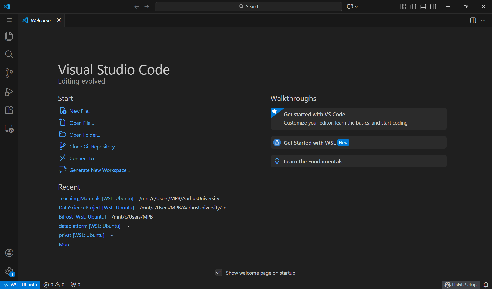


---

<!-- _class: lead -->

# Part 2: Adding Extensions

---

## Understanding VS Code Layout

<style scoped>
.columns {
  display: grid;
  grid-template-columns: 1fr 1fr;
  gap: 40px;
}
</style>

<div class="columns">

<div>

**Key areas we'll use:**

1. **Activity Bar** (orange) - Navigate between views
2. **Side Bar** - (red) File Explorer, Search, Extensions
3. **Editor** - (green) Where you write code
4. **Terminal** - (blue) Command line interface (bottom)

</div>

<div>

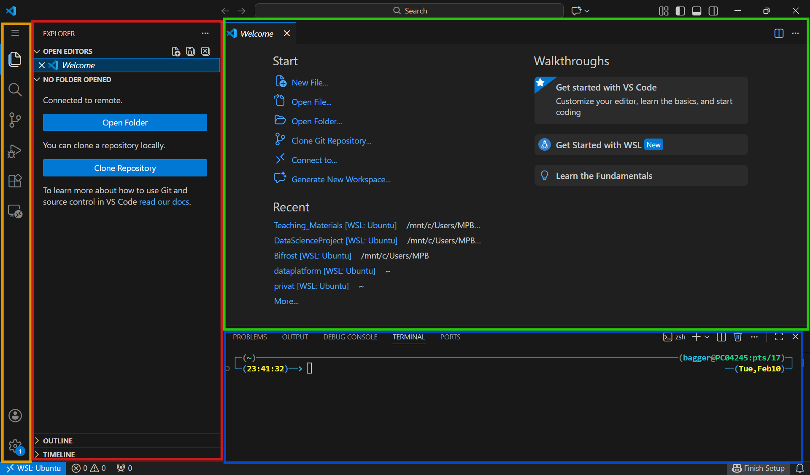

</div>

</div>

---


---

## Opening Extensions Panel

**Click Extensions icon** (or press `Ctrl+Shift+X` / `Cmd+Shift+X`)

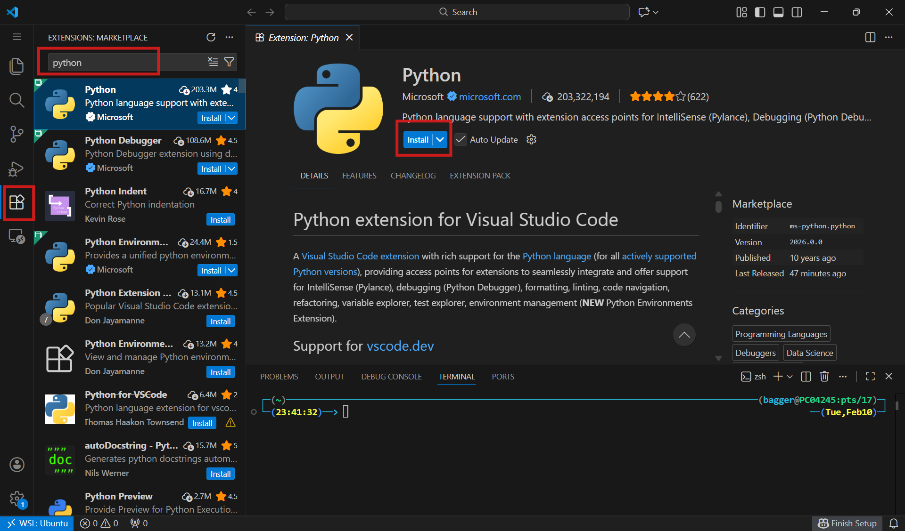

This is where we install tools!

---

## Install: Python Extension

**Search:** "Python"

**Install:** Python by Microsoft

This gives you:
- Python syntax highlighting
- Code completion
- Debugging
- Jupyter notebook support

---

## Install: Pylance (Auto-installs with Python)

**Pylance provides:**
- Fast IntelliSense
- Type checking
- Auto-imports

Should install automatically with Python extension!

---

## Recommended: Additional Extensions

**Search and install:**

1. **Jupyter** - For notebooks
2. **Ruff** - Fast linter/formatter
3. **GitLens** - Git integration (optional)

---

<!-- _class: lead -->

# Part 3: Opening the Terminal

---

## Open Integrated Terminal

**Three ways:**

1. **Menu:** Terminal → New Terminal
2. **Keyboard:** `` Ctrl+` `` (backtick)
3. **Command Palette:** `Ctrl+Shift+P` → "Terminal: Create New Terminal"

---

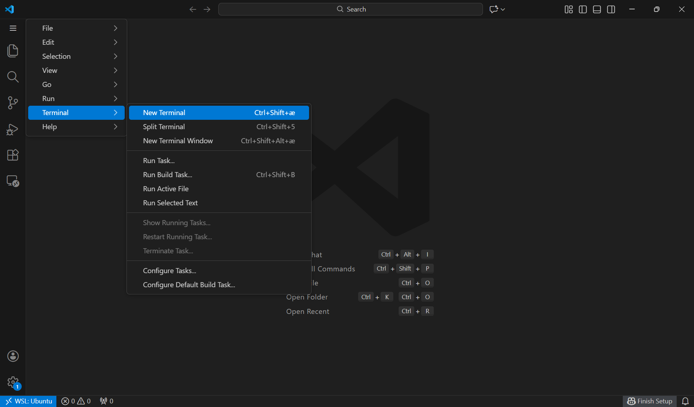

---

## Terminal Appears at Bottom

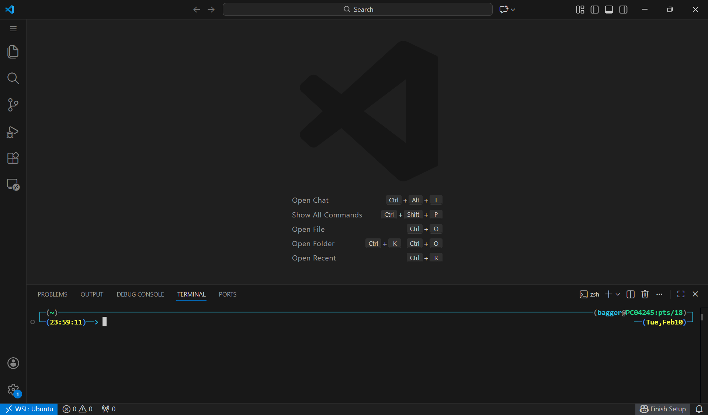

---

**You'll see:**
- Your current directory
- Command prompt
- Shell type (PowerShell/bash/zsh)

**This is your connection to the system!**

---

## Understanding: Where Am I?

**Terminal shows current directory:**

```bash
# Windows
PS C:\Users\YourName>

# Mac/Linux
~ $
```

**Check location:** `pwd` (print working directory)

---

<!-- _class: lead -->

# Part 4: Installing UV

---

## Install UV from Terminal

**Windows (PowerShell):**
```powershell
powershell -c "irm https://astral.sh/uv/install.ps1 | iex"
```

**Mac/Linux:**
```bash
curl -LsSf https://astral.sh/uv/install.sh | sh
```

**Press Enter and wait...**

---

## Verify Installation

**Close and reopen terminal**, then:

```bash
uv --version
```

**Expected:** `uv 0.x.x`

✅ If you see version number, UV is installed!

---

<!-- _class: lead -->

# Part 5: Creating Your First Project

---

## Choose Project Location

**Navigate to where you want your projects:**

This could be e.g. `Documents/`:

```bash
# Windows
cd C:\Users\YourName\Documents

# Mac/Linux
cd ~/Documents
```


---

## Create Projects Folder (Optional)

```bash
mkdir Projects
cd Projects
```

**Now you have a clean place for all your projects!**

---

## Open folder in VS Code File Explorer

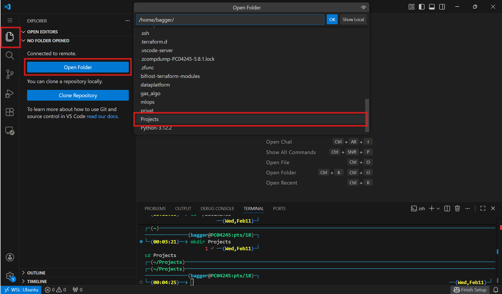


---

## Initialize New Project with UV

```bash
uv init my_first_project
```

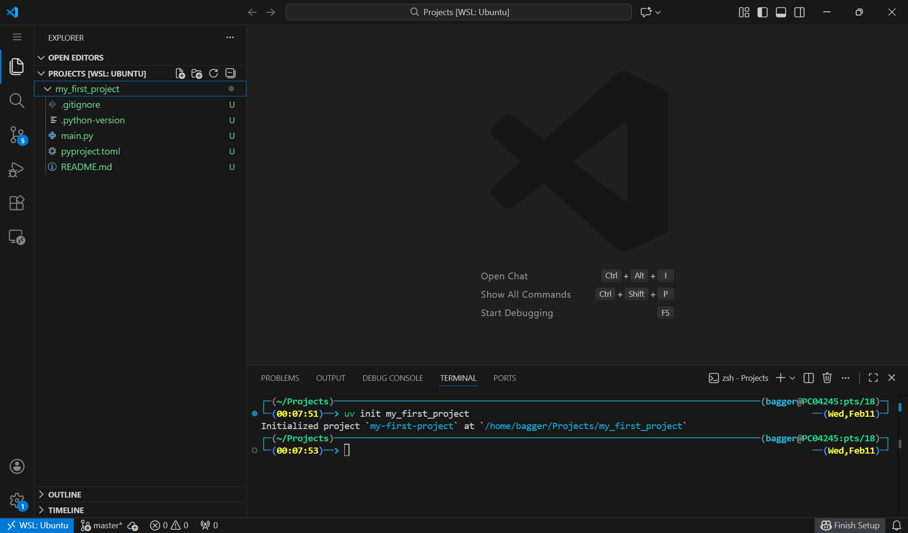

---

## What Just Happened?

**UV creates a new folder `my_first_project/` with:**

```
my_first_project/
├── pyproject.toml      ← Project settings & dependencies
├── .python-version     ← Python version specification
├── main.py             ← Sample Python file
├── README.md           ← Documentation
└── .gitignore          ← Git ignore rules
```

---

## VS Code File Explorer

**Left sidebar shows project files:**


**You can now see:**
- `pyproject.toml`
- `.python-version`
- `main.py`
- `README.md`
- `.gitignore`

**Click any file to open it!**

---

## Connection: Explorer <-> Terminal

**Explorer shows folders** <-> **Terminal navigates folders**


When you:
- **Click folder** in Explorer → See its contents
- **`cd folder`** in terminal → Navigate to that folder

**They're connected to the same location!**

---

## Open main.py

**Click `main.py` in Explorer:**

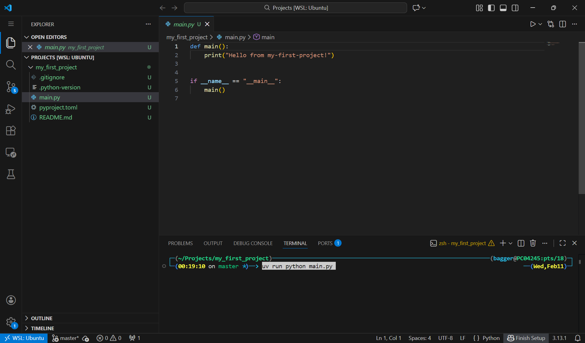

---

**Editor shows the code:**
```python
def main():
    print("Hello from my_first_project!")

if __name__ == "__main__":
    main()
```

---

## Run Your First Python File (terminal)

```bash
cd my_first_project # Make sure you're in the project folder
uv run python main.py
```

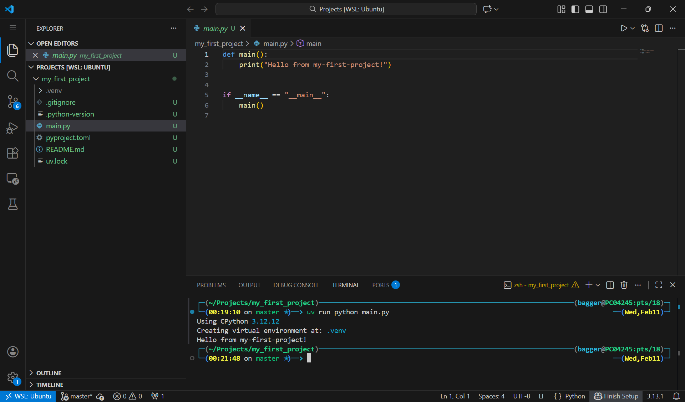

---

**Output:**
```
Hello from my_first_project!
```

🎉 **Your first Python program is running!**

---

## Understanding: uv run

**Why `uv run python main.py`?**

```bash
uv run python main.py
  │     │      │
  │     │      └─ File to run
  │     └─ Python interpreter
  └─ Use project's virtual environment
```

**Benefits:**
- No manual environment activation needed
- Always uses correct project environment
- Ensures consistency

---

## First `uv run` on a Project

First time you run `uv run` in a project folder, UV will:
1. Create a virtual environment in `.venv/`
2. Install Python (if not already)
3. Create a `uv.lock` file to track dependencies

**After this, every `uv run` will use that environment!**


---

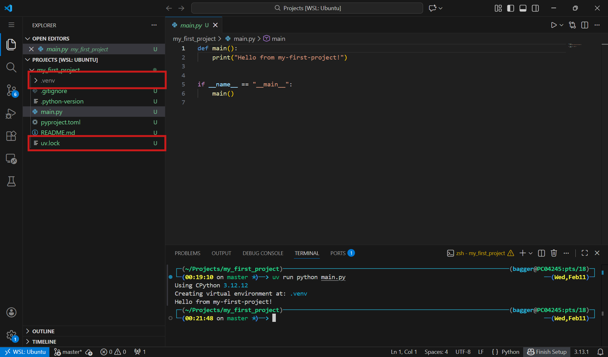

---

<!-- _class: lead -->

# Part 7: Adding Packages

---

## the pyproject.toml File

**Open `pyproject.toml` in Explorer:**

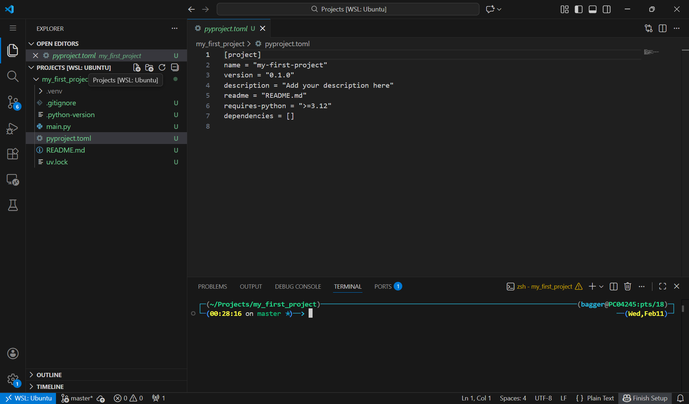

---

**This file contains:**

The project's configuration:
- Project metadata (name, version)
- Python version requirement
- Dependencies (packages your project needs)
- Development dependencies (testing, formatting tools)
- Build system requirements
- Optional settings for tools

---
## Add Your First Package

**Let's add pandas (data analysis library):**

```bash
uv add pandas
```

**UV will:**
1. Download pandas
2. Install to `.venv/`
3. Update `pyproject.toml`
4. Create or update `uv.lock` (lock of exact versions for reproducibility!)

---

## See What Changed

**Open `pyproject.toml` in Explorer:**


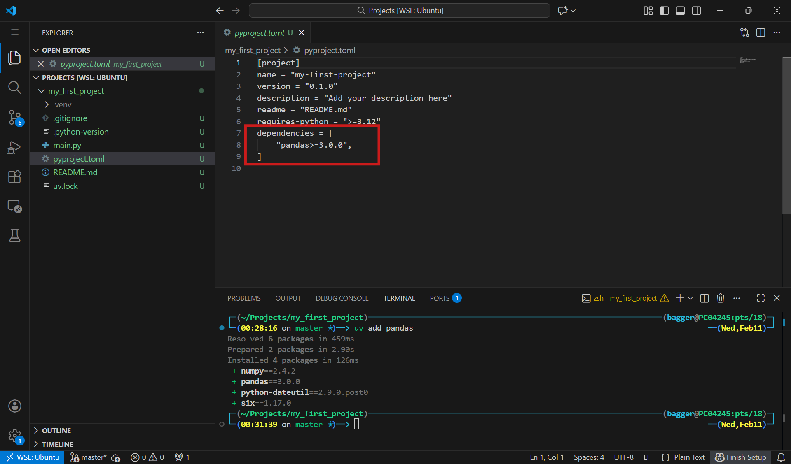

---


# Extra

---

## Create a Data Analysis Script

**Click "New File" button in Explorer:**


**Name it:** `analyze.py`

---

## Write Code in Editor

**Type in `analyze.py`:**

```python
import pandas as pd

# Create simple dataset
data = {
    'Name': ['Alice', 'Bob', 'Charlie'],
    'Age': [25, 30, 35],
    'City': ['Aarhus', 'Copenhagen', 'Odense']
}

df = pd.DataFrame(data)
print(df)
```


---

## Run Your Analysis

**In terminal:**
```bash
uv run python analyze.py
```


**Output:**
```
      Name  Age        City
0    Alice   25      Aarhus
1      Bob   30  Copenhagen
2  Charlie   35      Odense
```

---

<!-- _class: lead -->

# Understanding the Workflow

---

## The Complete Flow

**1. File Explorer** (Left)
- See all project files
- Click to open/edit

**2. Editor** (Center)
- Write and edit code
- Multiple files in tabs

**3. Terminal** (Bottom)
- Install packages (`uv add`)
- Run code (`uv run python script.py`)
- Navigate folders (`cd`)


---

## Workflow Example: Adding a Feature

**1. Install package** (Terminal):
```bash
uv add matplotlib
```

**2. Create file** (Explorer):
- Click "New File" → `plot.py`

**3. Write code** (Editor):
```python
import matplotlib.pyplot as plt
# ... your plotting code
```

**4. Run** (Terminal):
```bash
uv run python plot.py
```

---

## File Explorer ↔ Terminal Navigation

**They show the same location!**


**Explorer folder tree** = **Terminal `cd` path**

When you:
- Click folder in Explorer → Terminal still at same place
- `cd folder` in terminal → Explorer shows you're there
- `cd ..` (go up) → Explorer shows parent folder

---

<!-- _class: lead -->

# Common Tasks

---

## Task 1: Create New Python File

**Explorer:**
1. Click "New File" button
2. Name: `my_script.py`

**Terminal:**
```bash
# File now exists!
uv run python my_script.py
```


---

## Task 2: Create New Folder

**Explorer:**
1. Right-click in file area
2. "New Folder"
3. Name: `data/`

**Terminal:**
```bash
# Or create from terminal
mkdir data
cd data
```


---

## Task 3: Install Multiple Packages

**Terminal:**
```bash
uv add numpy pandas matplotlib
```

**See changes in:**
- `pyproject.toml` (dependencies list)
- `uv.lock` (exact versions)


---

## Task 4: Open Another Project

**File → Open Folder...**

Or from terminal:
```bash
cd ../another_project
code .
```


---

<!-- _class: lead -->

# Tips & Tricks

---

## Tip 1: Integrated Terminal Follows Explorer

**When you open a new folder:**
- Terminal **automatically** changes to that folder
- Always in sync with current project!


---

## Tip 2: Multiple Terminal Windows

**Click `+` in terminal panel:**


Use for:
- One for running code
- One for installing packages
- One for Git commands

---

## Tip 3: Command Palette

**Press:** `Ctrl+Shift+P` (Windows/Linux) or `Cmd+Shift+P` (Mac)


**Search for any command:**
- "Python: Select Interpreter"
- "Terminal: Create New Terminal"
- Anything!

---

## Tip 4: Quick File Navigation

**Press:** `Ctrl+P` / `Cmd+P`


**Type filename** → Opens instantly!

No clicking through folders!

---

## Tip 5: Terminal Shortcuts

```bash
# Navigation
pwd         # Print current directory
ls          # List files (Mac/Linux)
dir         # List files (Windows)
cd ..       # Go up one level
cd ~        # Go to home directory

# Clear screen
clear       # Mac/Linux
cls         # Windows
```

